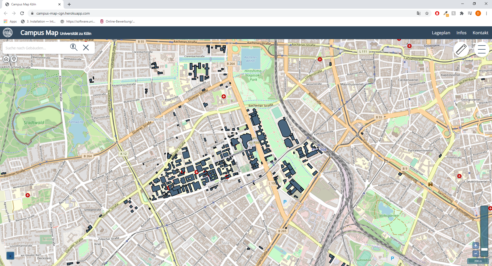

<!-- TABLE OF CONTENTS -->

## Table of Contents

- [About the Project](#about-the-project)
  - [Built With](#built-with)

<!-- ABOUT THE PROJECT -->

## About The Project



Campus Map Köln - based on React and OpenLayers. The Campus Map is an interactive and web based informationssystem for university campus environment. It is a so called geographic information system (GIS) that allows
the online-search for persons, buildings and facilities. The results of the queries are enhanced with spatial information. It improves the orientation on campus by using geodata services.

Here are some of the campus maps key features:

- based on modern web2.0 technologies such as React.js, Node and AJAX
- search for buildings, persons and facilities related informations
- and many more to come...

### Built With

The Campus Map is built with the following libraries and frameworks:

- [React.js](https://reactjs.org/)
- [OpenLayers](https://openlayers.org/)
- [react-geo](https://github.com/terrestris/react-geo)
- [antd](https://ant.design/)

- and [Express](https://expressjs.com/de/) to deploly app to [heroku](https://www.heroku.com/)

<!-- Development requirements -->

## Development requirements

- Node.js 10.13.0 or later
- npm 6.8.9 or later
- Git 2.11 or later

<!-- GETTING STARTED -->

## Getting Started

To get a local copy up and running follow these simple example steps.

### Installation

1. Clone the repo

```sh
git clone https://github.com/dmenneck/campus-map.git
```

2. Install NPM packages

```sh
npm install
```

3. Start development server

- cd into root-Folder and execute following line in a terminal

```sh
npm start
```

<!-- USAGE EXAMPLES -->

## Usage

This space will be used to show useful examples of how this project can be used. Additional screenshots, code examples and demos will be added aswell.

- needs to be filled with information - coming soon!

<!-- Additional informations -->

## Additional informations

- due to "problems" with the context api not all layers could initially be created within the Layers.js component.
  Could be fixed by putting the provider one level up (app.js or index.js)

- attributes
  - entrance = entrance, not barrier free
  - barrierfree = entrance, barrierfree

<!-- CONTRIBUTING -->

## Contributing

Contributions are what make the open source community such an amazing place to be learn, inspire, and create. Any contributions you make are **greatly appreciated**.

1. Fork the Project
2. Create your Feature Branch (`git checkout -b feature/AmazingFeature`)
3. Commit your Changes (`git commit -m 'Add some AmazingFeature'`)
4. Push to the Branch (`git push origin feature/AmazingFeature`)
5. Open a Pull Request

<!-- LICENSE -->

## License

Further information coming soon

<!-- CONTACT -->

## Contact

Dr. rer. nat. Christian Willmes - [@github](https://github.com/cwillmes) - c.willmes@uni-koeln.de

Dirk Mennecke - [@github](https://github.com/dmenneck) - dmennecke@uni-osnabrueck.de
